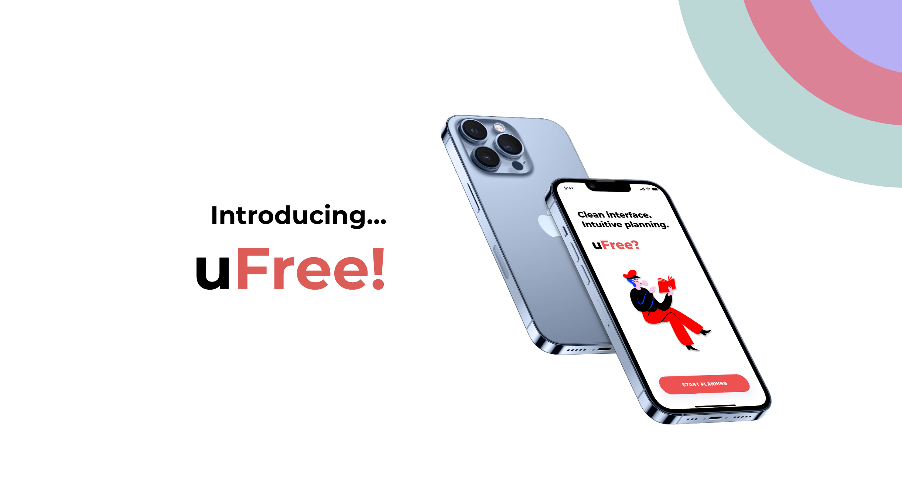
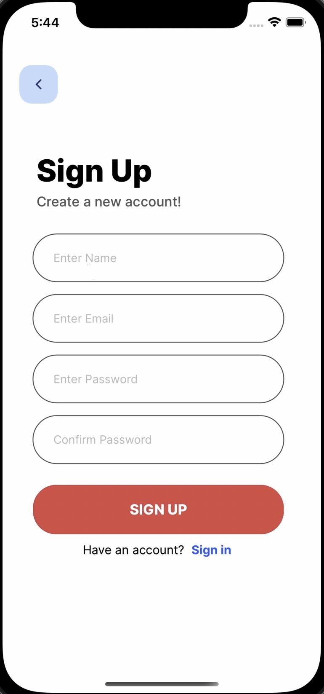
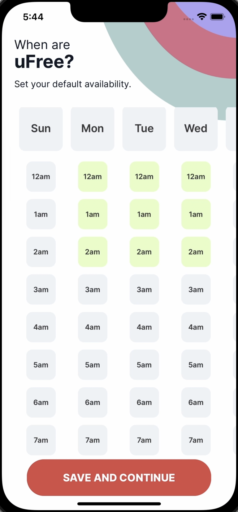
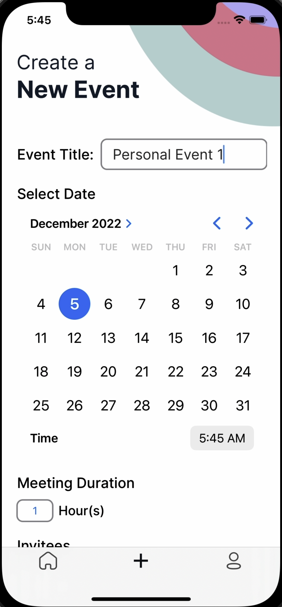
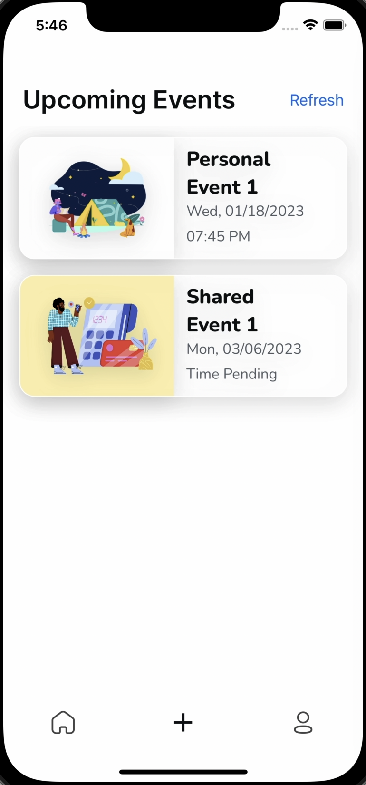

# ⏰ uFree Scheduling App

**Created with Hannah Chen \(@hcchen012\), Susie Choi \(@susiechoii\), Ian Youth \(@iyouth23\) and Nico Stuart \(@nicostuart\)**

iOS Scheduling App (WhenIsGood but with improved UI) created for Mobile App Dev I Class

_\#Swift \#SwiftUI \#Firebase_ 

> [!IMPORTANT]
> The app does not work now, as the backend servers are down. Please refer to screenshots for what uFree looks like.

## Premise
WhenIsGood (or similar scheduling apps) is an essential tool for planning events and meeting times with groups of people. The issue with WhenIsGood is that the UI looks very dated, and does not have a mobile app. uFree aims to solve this by being a dedicated iOS app with clean and modern UI/UX.

## Features
1. Default calendar with availability defined at user onboarding 
2. Create events with different descriptions held at different dates, times and durations
3. Invite multiple users to the events
4. Use default calendar to modify availability for that particular invited event
5. Event host picks a final date and time based on sent availability from other users

## This Project Showcases:
- 📚 Full stack web development
  - **Swift/SwiftUI** for the frontend framework
  - **Google Firebase** for the backend framework
- 🏃‍♂️ Agile development with teammates, from prototyping to release

## My Contributions
- I contributed to both the frontend and backend of the app, including coding the foundations of the frontend with SwiftUI, and organizing and coding the backend Firebase framework.

## Screenshots

> Login Screen

> Default Calendar

> Event Creation

> Home Screen

## To Improve for V2
- [ ] Revamped UI for Tab Bar, Event Details Page
- [ ] Additional functionality, including editing event details.
